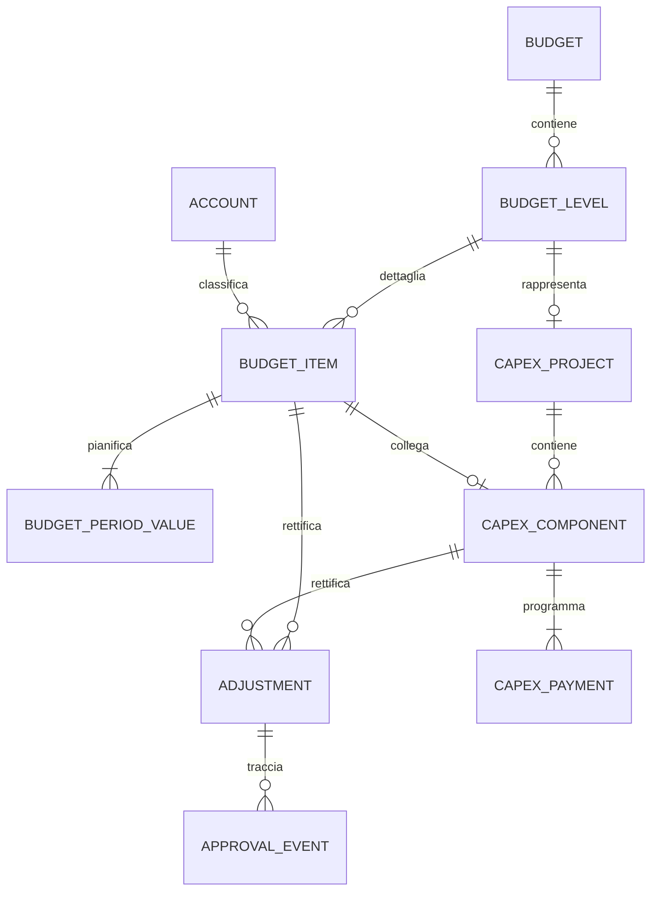

# Budget analitico Wingest — specifica funzionale e tecnica per l'integrazione ERP

Versione di riferimento: mockup locale modulare del 24/09/2026. Documento di proposta per analisi tecnica e stima; non descrive funzionalità già disponibili in Wingest né impone lo stack del prototipo.

## 1. Obiettivo e confini

Realizzare nell'ERP una gestione di budget analitici **ordinari** e **di investimento** con intestazione, livelli/commesse, voci associate a sottoconti, pianificazione mensile, rettifiche e, solo per gli investimenti, piano CAPEX dei pagamenti. Il mockup HTML è il riferimento visuale e interattivo; il codice Python/JavaScript e i due file SQLite sono un ambiente dimostrativo, non un'architettura prescritta per Wingest.

La realizzazione deve conservare la distinzione tra dato di budget, rettifica approvata, piano dei pagamenti e dato consuntivo. Il consuntivo non è implementato nel mockup e non è incluso in questa specifica.

### Artefatti consegnati

| File | Uso |
| --- | --- |
| `index.html`, `assets/css/styles.css`, `assets/js/` | Comportamento e aspetto del mockup modulare. Questo è il riferimento corrente, non il vecchio HTML monolitico. |
| `server.py`, `schema.sql` | Mini-server locale e persistenza dello stato demo. |
| `schema_normalizzato.sql` | Schema SQLite interrogabile di riferimento, non schema Wingest già validato. |
| `scripts/init_normalized_db.py` | Proiezione dei dati demo nello schema relazionale. |
| `query_esempio.sql` | Query per ispezionare budget, voci, rettifiche e CAPEX. |
| `ARCHITETTURA_DATABASE.md` | Proposta di evoluzione del modello. |
| `README.md` | Avvio del mockup. |

## 2. Comportamento delle schermate

### 2.1 Gestione budget

La prima pagina presenta una **intestazione** (riga verde) per budget e le righe dei **livelli** sottostanti. L'intestazione comprende almeno anno, nome, versione, periodicità, revisione, tipologia della struttura, tipo `Ordinario`/`Investimento` e stato. Si può aprire l'analisi sull'intestazione, che include *tutti* i livelli del budget, oppure su un solo livello. Esempio: aprendo l'intestazione GRANA devono comparire GRA-001, GRA-002 e GRA-003; aprendo GRA-001 compare solo quel livello. Le modifiche all'intestazione e al livello sono operazioni distinte.

### 2.2 Redazione: regole comuni

Il selettore **Tipo budget** cambia tra ordinario e investimento; **Nome BDG** seleziona il budget del tipo corrente. Le tabelle 1 e 2 sono riepiloghi calcolati, non luoghi dove digitare importi. La tabella 3 contiene la pianificazione mensile su dodici colonne, con schede separate **Costi** e **Ricavi** e un unico totale della scheda corrente. Il pulsante **＋ Nuova voce** è nell'intestazione della tabella 3 in entrambi i tipi di budget.

| Tabella | Contenuto e comportamento |
| --- | --- |
| 1. Livelli del budget | Codice, descrizione, totale ricavi, totale costi. **Non** mostra la durata. Solo per investimento aggiunge **Fonte di finanziamento**, campo editabile a livello/commessa. |
| 2. Voci e sottoconti collegati | Codice livello, descrizione livello, voce, sottoconto, durata, totale ricavi, totale costi. I totali derivano dalle voci della tabella 3. |
| 3. Pianificazione mensile | Una riga per voce/sottoconto/natura, colonne gennaio–dicembre, totale annuale e azioni. Le schede Costi/Ricavi non vanno fuse in due colonne di totale sulla stessa riga. |
| 4. Pagamenti CAPEX | Visibile **solo** per `Investimento`. Non deve comparire per `Ordinario`. |

**Nuova voce nella tabella 3.** L'utente seleziona livello, natura costo/ricavo, descrizione, sottoconto, importo e ripartizione iniziale. Il salvataggio crea la voce e i valori periodici; la nuova riga appare nella tabella 3 e i totali delle tabelle 2 e 1 si aggiornano senza inserimenti duplicati. Il sottoconto non deve essere riutilizzato contemporaneamente con natura opposta senza una regola esplicita di riconciliazione. Va impedito il duplicato della stessa combinazione livello, sottoconto, voce e natura. Le modalità iniziali demo sono mensile, trimestrale o tutto in un mese.

**Ripartisci.** L'azione sulla riga della tabella 3 apre il popup di redistribuzione con importo complessivo, durata, periodicità, data iniziale, natura e righe data/importo. Confermando, i valori dei mesi dell'anno selezionato vengono aggiornati e i totali ricalcolati. Per una voce di investimento collegata al CAPEX, la nuova somma annuale del budget deve restare uguale al CAPEX aggiornato; cambiare il *totale* dopo approvazione richiede la regola delle rettifiche, non una semplice redistribuzione.

### 2.3 Redazione: solo investimento e tabella 4

La tabella 4 mostra **Commessa, Voce, Fonte, Vita utile, Stato, Gen–Dic, CAPEX iniziale, Rettifiche, CAPEX aggiornato, Ammortamento dell'anno e Azioni**. Il nome di colonna è **Voce**, non “Componente”; la colonna **Categoria** non è prevista nell'interfaccia. I dodici importi sono pagamenti pianificati, non un secondo costo da sommare alla tabella 3. È possibile aprire la modifica cliccando **Modifica voce** oppure un importo mensile: il mese cliccato riceve il focus nel modulo con tutti e dodici i mesi.

La creazione di una voce CAPEX richiede commessa, descrizione, sottoconto, fonte di finanziamento, vita utile, stato, importo iniziale, ammortamento demo e dodici pagamenti. Il salvataggio crea anche una voce di costo collegata nella tabella 3, se non esiste già. Una voce di ricavo dell'investimento, ad esempio un contributo, resta nella tabella 3 ma non diventa automaticamente una voce CAPEX.

**Scelta di progetto proposta per il mockup:** la tabella 3 è il calendario del *budget* della voce; la tabella 4 è il calendario dei suoi *pagamenti*. Possono differire mese per mese ma devono riconciliarsi sul totale annuale. I dati iniziali contengono già casi in cui il calendario differisce: non bisogna spostare automaticamente i mesi del budget quando si cambia una data di pagamento. Una variazione dell'importo totale di una voce CAPEX deve invece mantenere uguali i due totali annuali; nel mockup il calendario di budget esistente viene ridimensionato proporzionalmente. La regola definitiva di variazione degli importi dopo approvazione è da validare con il cliente.

La **Fonte di finanziamento** della tabella 1 è un attributo manuale del livello/commessa. La **Fonte** della tabella 4 è un attributo della singola voce CAPEX. Oggi il primo campo può indicare “Fonti miste” e non aggiorna automaticamente le fonti delle voci sottostanti. Per l'ERP va deciso se mantenere questa distinzione o calcolare il riepilogo dalle voci.

## 3. Formule, invarianti e arrotondamenti

Per ogni voce `i`, mese `m` e natura `n`:

```text
budget_aggiornato(i,m) = budget_base(i,m) + somma(rettifiche_approvate(i,m))
totale_voce(i) = somma dei 12 budget_aggiornato(i,m)
totale_livello(n) = somma totale_voce(i) delle voci del livello con natura n
CAPEX_aggiornato(c) = CAPEX_iniziale(c) + somma(rettifiche_CAPEX_approvate(c))
somma dei 12 pagamenti(c) = CAPEX_aggiornato(c)
totale_annuo_voce_budget_collegata(c) = CAPEX_aggiornato(c)
```

Le rettifiche in **Bozza**, **In approvazione** o **Respinte** non entrano nei totali ufficiali. I ricavi e i costi non si compensano nella tabella 1 o 2. Il totale CAPEX non va sommato nuovamente ai costi della tabella 3. Gli importi devono essere calcolati con decimali a due cifre (nel demo SQLite: centesimi interi); i controlli di uguaglianza vanno eseguiti in centesimi, mai confrontando direttamente numeri floating point.

**Attenzione al demo esistente:** la voce CAPEX “Impianti elettrici” espone 60.000 € iniziali + 20.000 € di rettifica = 80.000 € aggiornati; la voce budget collegata contiene già 80.000 € nei valori base del mockup. Il modello definitivo non deve applicare una *seconda* rettifica da 20.000 € sulla stessa voce di budget. Una sola variazione approvata deve alimentare entrambe le viste, senza doppio conteggio. Questo punto richiede una migrazione/riconciliazione esplicita dei dati demo, non una copia letterale del JSON.

## 4. Modello dati logico proposto



| Entità | Chiave e campi funzionali essenziali | Vincoli principali |
| --- | --- | --- |
| `budget` | ID, anno, nome, versione, revisione, tipo, periodicità, struttura, stato | Unicità definita per anno/nome/versione; storicizzare le revisioni effettive. |
| `budget_level` | ID, budget ID, codice, descrizione, fonte di finanziamento del livello (solo investimento), stato | Codice univoco nel budget; appartiene a un solo budget. |
| `account` | ID, codice, descrizione, natura, attivo | Collegare all'anagrafica/sottoconti Wingest esistente, previa verifica del mapping. |
| `budget_item` | ID, livello ID, account ID, voce, natura costo/ricavo | Una voce appartiene a un livello; possibile collegamento 1:0..1 a CAPEX. |
| `budget_period_value` | Voce ID, mese, importo base | Una riga per voce/mese/anno; dodici mesi in visualizzazione annuale. |
| `adjustment` e `approval_event` | Destinazione voce **oppure** CAPEX, mese se applicabile, importo, motivo, stato, attori e date | Non cancellare il budget base approvato; audit delle decisioni. |
| `capex_project` | Livello investimento, codice commessa, stato | Una commessa appartiene al budget di investimento. |
| `capex_component` | Progetto, voce budget collegata, descrizione, fonte, vita utile, importo iniziale, stato | Il nome tecnico può restare `component`; in UI è “Voce”. `category` è legacy nel demo e non è un campo richiesto a video. |
| `capex_payment` | Voce CAPEX, mese/data, importo pianificato, stato | Dodici periodi per l'anno del budget; somma uguale al CAPEX aggiornato. |

Lo schema eseguibile di esempio è `schema_normalizzato.sql`. Non usarlo come migrazione diretta del database Wingest prima di aver mappato entità già esistenti, chiavi, permessi e regole contabili. `ARCHITETTURA_DATABASE.md` dettaglia l'evoluzione proposta.

## 5. Contratto applicativo suggerito per lo sviluppatore

Sono operazioni **da progettare nell'ERP**, non API Wingest già esistenti:

1. `GET budget + livelli + totali`: filtri anno, tipo, versione, stato; apertura di intestazione o livello.
2. `GET analisi`: voci, valori mensili, rettifiche approvate, riepiloghi calcolati, eventuale CAPEX.
3. `POST/PUT voce`: validazione natura/sottoconto, transazione che salva voce e dodici valori.
4. `PUT ripartizione`: sostituzione atomica dei dodici periodi; controllo del totale per la voce CAPEX collegata.
5. `POST/PUT voce CAPEX`: salvataggio atomico di voce CAPEX, collegamento alla voce budget e dodici pagamenti.
6. `POST rettifica` e comandi di approvazione: permessi, motivo, allegato/riferimento, storico e ricalcolo delle viste solo allo stato approvato.

Calcoli e vincoli vanno verificati **lato server**, non solo nel browser. In un'app multiutente occorrono identificativo stabile, controllo di concorrenza (versione/ETag o equivalente), transazioni, audit utente/data e risposta esplicita agli errori di validazione. Le tabelle 1 e 2 vanno alimentate da query o viste calcolate, non da importi duplicati editabili. La UI può aggiornarsi in anteprima, ma dopo il salvataggio deve mostrare i valori confermati dal backend.

## 6. Come ottenere, avviare e connettere il mockup

Il pacchetto distribuibile è `dist/Mockup_Budget_Analitico_Wingest_sviluppatore.zip`. Si rigenera dalla cartella del progetto con:

```powershell
py -3 scripts\create_developer_package.py
```

Se `py` non è presente, usare l'interprete Python 3 configurato sulla macchina. Il pacchetto contiene **codice, schema e documentazione**, ma non `data/*.db`, file WAL/SHM, cache Python, connessioni personali o il vecchio HTML monolitico. Per condividerlo con lo sviluppatore, consegnare il file ZIP tramite il canale aziendale approvato; il presente documento non presume un repository o un URL di download già pubblicato.

Lo sviluppatore estrae lo ZIP, apre la cartella `Mockup_Budget_Analitico_Wingest` in VS Code, avvia `start.bat` (Windows) oppure `python server.py` dalla cartella, quindi apre `http://127.0.0.1:8793/`. Python 3 è l'unica dipendenza di runtime; non occorrono `npm` né pacchetti Python aggiuntivi. Al primo avvio la pagina popola i dati demo; attendere il completamento del caricamento prima di aprire il database.

Per ispezionare il modello con SQLTools/driver SQLite in VS Code: creare una connessione **SQLite** al file `data/budget_wingest.db` nella cartella estratta, aprire `query_esempio.sql` ed eseguire le query 1–7. Il file `data/budget_mockup.db` contiene invece una sola riga JSON (`mockup_state`) ed è utile per il funzionamento del prototipo, non per analisi relazionali. `schema_normalizzato.sql` è il DDL completo del modello dimostrativo; `ARCHITETTURA_DATABASE.md` e il diagramma sopra sono il modello logico proposto. Se il database interrogabile manca, aprire la pagina una volta oppure eseguire `python scripts/init_normalized_db.py --replace` dopo che `budget_mockup.db` è stato creato.

Non collegare questo server alla rete aziendale o a un ambiente produttivo: ascolta solo su `127.0.0.1`, contiene dati demo e non implementa autenticazione/autorizzazione.

## 7. Criteri di accettazione minimi

1. Con budget **ordinario** sono visibili tabelle 1, 2 e 3; **non** la tabella 4. Con budget **investimento** si aggiunge la tabella 4 con Gen–Dic, colonna “Voce” e senza “Categoria”.
2. L'apertura dell'intestazione GRANA include GRA-001, GRA-002 e GRA-003; l'apertura di GRA-001 esclude gli altri livelli.
3. Aggiungendo nella tabella 3 un costo demo di 1.200 € a GRA-001, la tabella 3 mostra la riga e i totali della voce e del livello nelle tabelle 2 e 1 aumentano esattamente di 1.200 €. La stessa voce e i dodici valori sono interrogabili nel database.
4. La tabella 1 non ha “Durata”. Per investimento la fonte del livello è editabile e persiste al ricaricamento, senza modificare automaticamente le fonti delle singole voci CAPEX.
5. La tabella 4 permette modifica cliccando un mese o “Modifica voce”. Un pagamento spostato, ad esempio 5.000 € da marzo ad aprile senza cambiare il totale, resta salvato nei dodici periodi CAPEX e **non** sposta automaticamente i mesi della tabella 3.
6. Un piano CAPEX da 81.000 € contro un CAPEX aggiornato da 80.000 € non può essere salvato; l'errore indica la differenza. Il piano annuale valido compare identico dopo ricaricamento e nelle query SQL.
7. `CAPEX iniziale 60.000 + rettifica approvata 20.000 = CAPEX aggiornato 80.000`; i pagamenti sommano 80.000 €. La stessa variazione non viene conteggiata due volte nella voce budget collegata.
8. “Ripartisci” sulla tabella 3 di una voce CAPEX può cambiare i mesi del budget, ma non il suo totale annuale riconciliato con il CAPEX; il piano pagamenti della tabella 4 non cambia.
9. Le rettifiche non approvate restano visibili nello storico ma non incidono sui totali. Ogni salvataggio è atomico e non lascia budget/CAPEX disallineati.

