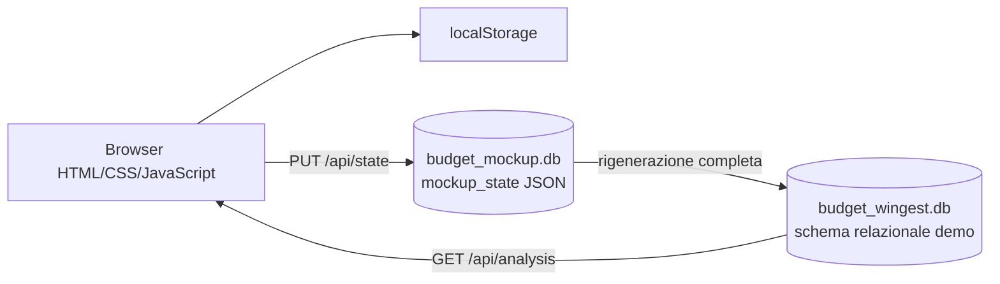

# Analisi dello stato attuale e gap verso l'applicazione Wingest

Aggiornamento: 25/09/2026.

## 1. Sintesi

`AppBudgetDemo` è un mockup locale già utilizzabile per discutere l'esperienza utente e verificare alcune regole numeriche. Copre due tipi di budget, la pianificazione mensile, le rettifiche e il piano CAPEX pluriennale. Non è però un modulo Wingest pronto per la produzione: non usa gli archivi reali dell'ERP, non implementa autenticazione e autorizzazioni, salva l'intero stato come JSON e affida buona parte delle regole al browser.

La base è utile come riferimento visuale, dataset di esempio e specifica eseguibile. Lo sviluppo reale deve riprendere i comportamenti approvati, non trasferire automaticamente lo stack Python/SQLite/JavaScript del prototipo.

## 2. Architettura effettivamente implementata

### Frontend

- Interfaccia statica modulare in `index.html`, `assets/css` e `assets/js`.
- Stato iniziale e dati dimostrativi separati in `assets/js/data/demo-data.js`.
- Componenti di tabella come funzioni JavaScript che producono HTML.
- Calcoli CAPEX isolati in `assets/js/core/capex-plan.js`.
- Persistenza immediata nel `localStorage` del browser e, se il server risponde, invio differito dell'intero stato a `PUT /api/state`.

### Server locale

- Server HTTP Python in ascolto solo su `127.0.0.1:8793`.
- API disponibili: lettura/scrittura dello stato, reset, health check e lettura dei riepiloghi relazionali.
- Controllo del payload limitato alla presenza delle cinque proprietà principali; le regole funzionali non vengono rivalidate completamente lato server.
- Nessuna autenticazione, autorizzazione, sessione utente o gestione della concorrenza.

### Persistenza

- `budget_mockup.db` è la sorgente modificabile del prototipo e contiene una singola istanza JSON.
- Dopo ogni salvataggio, `budget_wingest.db` viene rigenerato dal JSON. È quindi una proiezione interrogabile, non la sorgente primaria.
- Lo schema relazionale demo contiene budget, livelli, sottoconti, voci, periodi, rettifiche, eventi di approvazione e dettagli CAPEX.
- Gli importi sono memorizzati in centesimi interi nella proiezione SQLite.

## 3. Funzioni presenti nel mockup

| Area | Stato | Evidenza e limite |
| --- | --- | --- |
| Elenco budget e livelli | Implementato nel mockup | Intestazioni verdi, righe di livello, modifica e creazione. I filtri operativi sono struttura e stato. |
| Apertura analisi | Implementato nel mockup | Apertura dell'intero budget o di un singolo livello. |
| Budget ordinario | Implementato nel mockup | Tabelle riepilogative e pianificazione mensile separata tra costi e ricavi. |
| Nuova voce | Implementato nel mockup | Descrizione libera, sottoconto, importo e ripartizione iniziale; controlli di duplicato nel browser. |
| Redistribuzione | Implementato nel mockup | Modifica dei mesi; per una voce CAPEX collegata viene controllato il totale annuale. |
| Rettifiche | Parzialmente implementato | Creazione in bozza e invio in approvazione. Non esiste un vero processo con ruoli, decisioni, notifiche e audit completo. |
| Budget di investimento | Implementato nel mockup | Vista CAPEX alternativa alla pianificazione mensile e fonte di finanziamento sul livello. |
| Pagamenti CAPEX | Implementato nel mockup | Piano manuale, rate fornitore o finanziamento; capitale e interessi distinti; scadenze pluriennali. |
| Ammortamento | Implementato come stima demo | Quote lineari dalla data di entrata in funzione. La regola contabile non è validata. |
| Riepiloghi SQL | Implementato nel mockup | Dopo il salvataggio, le tabelle 1 e 2 possono essere rilette dalle viste SQLite. |
| Consuntivi e impegni | Non implementato | Esplicitamente fuori dalla specifica corrente. |
| Integrazione Wingest | Non implementato | Nessun collegamento a piano dei conti, anagrafiche, commesse, utenti o servizi Wingest. |

## 4. Regole numeriche già esplicitate

- Budget aggiornato = budget base + rettifiche approvate.
- Rettifiche in bozza, in approvazione o respinte non modificano i totali ufficiali.
- Costi e ricavi restano separati nei riepiloghi.
- CAPEX aggiornato = CAPEX iniziale + rettifiche CAPEX approvate.
- La somma del capitale di tutte le rate deve coincidere con il CAPEX aggiornato.
- Gli interessi aumentano le uscite finanziarie ma non il valore CAPEX.
- Il piano dei pagamenti e il calendario del budget rappresentano fenomeni distinti.
- Tutti i controlli di uguaglianza devono essere eseguiti in centesimi o con un tipo decimale, non con confronti diretti tra floating point.

## 5. Gap che impediscono l'uso produttivo

### Dati e integrazione

1. Il piano dei conti è ricavato dai dati demo; un codice digitato non viene validato contro un archivio Wingest.
2. Livelli, CDC e commesse non sono collegati alle anagrafiche reali.
3. Lo stato JSON completo non supporta aggiornamenti puntuali, transazioni di dominio e volumi reali.
4. La proiezione relazionale viene ricreata dopo ogni salvataggio e non può essere usata come write model multiutente.
5. La specifica concettuale usa in alcuni punti nomi diversi dal DDL demo, ad esempio `budget_value`/`budget_period_value` e `approval_step`/`approval_event`; il mapping definitivo deve essere dichiarato prima di creare le tabelle ERP.

### Sicurezza e processo

1. Non sono presenti login, ruoli o autorizzazioni per redazione, invio, approvazione e consultazione.
2. Il processo di approvazione è una variazione di stato locale e non registra in modo affidabile attore, data, esito e note.
3. Non esistono versionamento ottimistico, ETag o altro controllo delle modifiche concorrenti.
4. Il salvataggio nel browser può riuscire anche se SQLite non è disponibile; questo comportamento è accettabile per il demo, non per l'ERP.
5. Le validazioni decisive sono prevalentemente client-side e devono essere replicate nel backend.

### Funzioni e usabilità

1. I filtri data, esercizio e versione sono visibili ma non partecipano al filtro effettivo dell'elenco; oggi vengono applicati solo struttura e stato.
2. La modifica di un livello esistente non applica lo stesso controllo di unicità usato in creazione.
3. La creazione di un budget genera un livello segnaposto e non verifica una chiave univoca completa anno/nome/versione.
4. I dati demo mancanti vengono reinseriti all'avvio dal frontend; non esiste quindi un concetto produttivo di cancellazione o archiviazione.
5. Non sono definite le regole di eliminazione: per gli oggetti approvati la proposta è evitare la cancellazione fisica e usare stati/storico.

### Qualità e verifica

1. I test automatici correnti coprono quattro scenari del piano CAPEX, non i flussi completi di budget, rettifiche, API e migrazione.
2. Non sono presenti test di autorizzazione, concorrenza, transazione, accessibilità o integrazione Wingest.
3. Lo script di proiezione controlla integrità SQLite e capitale delle rate automatiche, ma non costituisce una migrazione verso il database ERP.

## 6. Rischi principali da gestire nei ticket

| Rischio | Conseguenza | Contromisura richiesta |
| --- | --- | --- |
| Doppio conteggio della rettifica CAPEX | Budget e investimento risultano sovrastimati | Un'unica rettifica approvata deve alimentare entrambe le viste attraverso un collegamento esplicito. |
| Duplicazione dei totali | Dati incoerenti tra dettaglio e riepilogo | I totali devono essere calcolati da periodi e rettifiche, non salvati come campi editabili. |
| Conto usato con natura incompatibile | Classificazione economica errata | Validazione server-side sul piano dei conti e sulla natura ammessa. |
| Salvataggi concorrenti | Perdita o sovrascrittura di modifiche | Versione di riga/documento e risposta di conflitto esplicita. |
| Regola contabile demo trattata come definitiva | Ammortamenti o CAPEX non conformi | Validazione funzionale e contabile prima di implementare l'automatismo definitivo. |
| Confusione budget/pagamenti | Somme duplicate o calendari allineati impropriamente | Mantenere separati importo di budget, capitale, interessi e flusso di cassa. |

## 7. Verifiche eseguite durante l'analisi

- `node --test tests/capex-plan.test.mjs`: 4 test superati.
- Avvio del server con l'interprete Python integrato richiamato da `start.bat`: riuscito.
- `GET /api/health`: risposta positiva.
- Caricamento di `/`: HTTP 200 e pagina corrente servita correttamente.
- Il test dell'interfaccia completa nel browser e dei flussi di scrittura non è stato automatizzato in questa analisi.

## 8. Conclusione

Il mockup è sufficientemente maturo per diventare una specifica eseguibile e per stimare il lavoro. La prima attività di sviluppo non deve però essere la copia delle schermate: occorre prima chiudere le decisioni funzionali, mappare gli oggetti Wingest esistenti e concordare il confine tra database, servizi backend e UI. Il piano e i ticket collegati seguono questo ordine.
