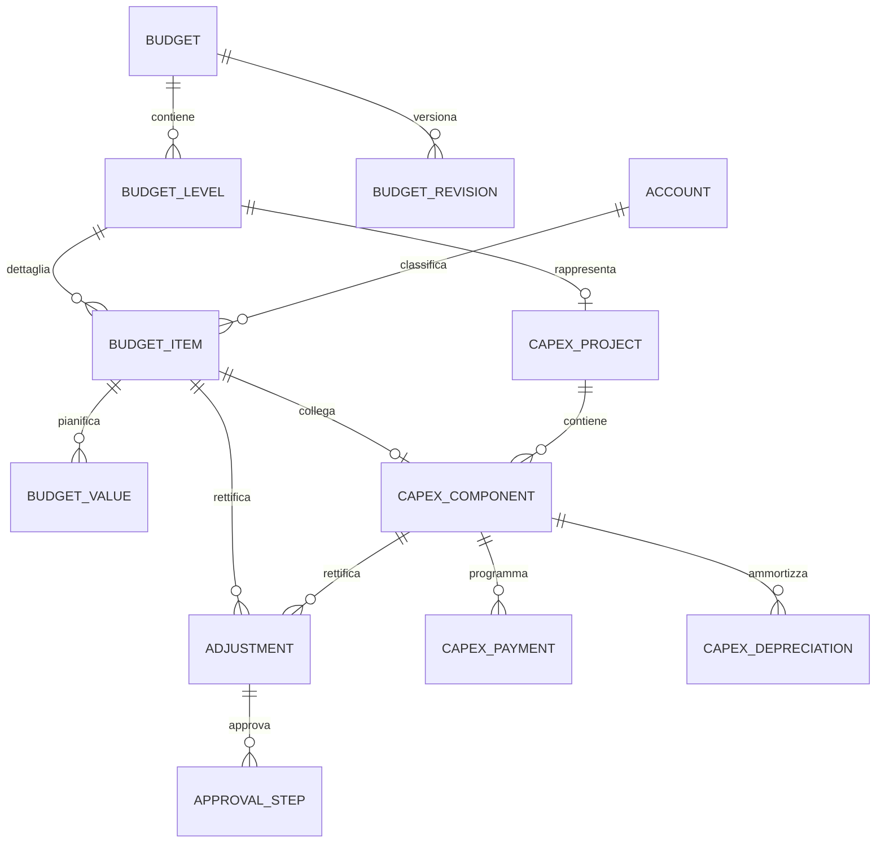

# Proposta di architettura dati

## 1. Situazione del mockup

Il prototipo conserva lo stato modificabile della pagina come JSON nella tabella `mockup_state` di `data/budget_mockup.db`. Dopo ogni salvataggio, il server aggiorna anche `data/budget_wingest.db`, con tabelle relazionali interrogabili da SQLTools.
Il primo file facilita le modifiche rapide del mockup; il secondo rende consultabili budget, livelli, voci, valori mensili, rettifiche e CAPEX.

**Aggiornamento del mockup 29/09/2026.** La pagina corrente persiste nel JSON anche `budget.planning`: catalogo degli elementi configurati, righe di Livello 1, righe di Livello 2 con riferimento esplicito al padre, percentuale sul padre, dodici valori mensili e stato di presenza della pianificazione. La proiezione relazionale descritta sotto è precedente al nuovo disegno e deve essere aggiornata prima di essere considerata uno schema definitivo.

Il salvataggio JSON non è il modello consigliato per l'applicazione definitiva, perché rende difficili:

- interrogazioni e controlli puntuali;
- gestione contemporanea di più utenti;
- tracciamento delle revisioni;
- autorizzazioni e iter approvativi;
- collegamento con contabilità, sottoconti e commesse Wingest.

## 2. Modello proposto



## 3. Tabelle principali

### `budget`

Intestazione corrispondente alla riga verde.

Campi principali: `id`, `code`, `name`, `year`, `version`, `frequency`, `budget_type`, `structure_type`, `status`, `revision_no`. Nel mockup `structure_type` memorizza la **struttura analitica associata** come testo libero, senza vincolo a CDC o commessa; `status` assume soltanto i valori `Attivo` e `Disattivo`.

### `budget_level`

Livelli utilizzati internamente nell’analisi, per esempio `GRA-001`, `TRA-001` o `CAP-DEP-01`. Non sono più esposti come righe bianche nella pagina Gestione Budget.

Campi principali: `id`, `budget_id`, `code`, `name`, `funding_source`, `status`, `parent_level_id`. `funding_source` è valorizzato solo per i livelli del budget di investimento; nel mockup è modificabile direttamente nella tabella 1.

`parent_level_id` permette in futuro una gerarchia, ma può rimanere nullo se si conferma un solo livello CDC.

### `account`

Anagrafica dei sottoconti proveniente dal piano dei conti Wingest.

Campi principali: `id`, `code`, `description`, `nature` (`COSTO`, `RICAVO`, `PATRIMONIALE`), `active`.

### `budget_item`

Associazione tra livello analitico, voce e sottoconto.

Campi principali: `id`, `budget_level_id`, `account_id`, `description`, `nature`, `duration_months`.

La natura deve essere separata e controllata: una voce è costo oppure ricavo. Per i budget ordinari sono ammessi conti economici; per gli investimenti anche conti patrimoniali autorizzati.

### `budget_value`

Valori periodici del budget.

Campi principali: `id`, `budget_item_id`, `period_date`, `base_amount`.

Vincolo consigliato: una sola riga per coppia `budget_item_id + period_date`. Il totale annuale deve essere sempre calcolato come somma dei periodi e non salvato in una colonna duplicata.

### `adjustment`

Rettifiche proposte senza sovrascrivere il budget originario.

Campi principali: `id`, `budget_item_id`, `capex_component_id`, `period_date`, `amount`, `reason`, `attachment_name`, `status`, `created_by`, `created_at`.

Regola: deve essere valorizzato un solo riferimento tra `budget_item_id` e `capex_component_id`.

Il budget aggiornato si calcola così:

```text
budget aggiornato = budget base + rettifiche approvate
```

Le rettifiche in bozza, in approvazione o respinte non devono modificare i totali ufficiali.

### `approval_step`

Storico dell'iter autorizzativo delle rettifiche.

Campi principali: `id`, `adjustment_id`, `step_no`, `actor`, `decision`, `note`, `decided_at`.

### `capex_project`

Commessa di capitalizzazione collegata a un livello di budget di tipo investimento.

Campi principali: `id`, `budget_level_id`, `code`, `description`, `status`, `start_date`, `end_date`.

### `capex_component`

Singola voce/cespite capitalizzabile mostrata nella tabella 4. Il campo `category` resta nello schema demo per compatibilità con i dati precedenti, ma non è più mostrato né richiesto nell'interfaccia.

Campi principali: `id`, `capex_project_id`, `budget_item_id`, `description`, `category`, `funding_source`, `useful_life_years`, `purchase_date`, `in_service_date`, `payment_mode`, `first_due_date`, `installment_count`, `interval_months`, `annual_interest_rate`, `approved_amount`, `status`.

`budget_item_id` collega la voce CAPEX alla voce già mostrata nelle tre tabelle del budget di investimento. Il dettaglio CAPEX non costituisce un secondo costo da sommare al budget.

### `capex_payment`

Piano dei pagamenti della voce CAPEX: scadenze datate, anche distribuite su più anni. Per il vecchio piano manuale restano dodici mesi nell'anno del budget. La tabella 4 mostra sempre dodici colonne per l'anno selezionato, ma non limita il piano sottostante a dodici rate.

Campi principali: `id`, `capex_component_id`, `due_date`, `principal_cents`, `interest_cents`, `amount_cents`, `payment_status`. Vale `amount_cents = principal_cents + interest_cents`.

Il CAPEX aggiornato è `approved_amount + rettifiche CAPEX approvate`. La somma del **capitale di tutte le rate**, indipendentemente dall'anno, deve coincidere con il CAPEX aggiornato. Gli interessi del finanziamento sono una voce distinta dalle immobilizzazioni e non aumentano il CAPEX. I mesi e gli anni dei pagamenti possono differire da quelli di imputazione del budget nella tabella 3; per la voce collegata deve restare uguale il totale del budget nell'anno dell'investimento, non ogni totale annuale dei pagamenti. Nel demo il finanziamento copre l'intero CAPEX; anticipo e copertura parziale non sono modellati.

### `capex_depreciation`

Una riga per voce CAPEX e anno. La quota è una **stima demo** calcolata in centesimi con criterio lineare dalla data di entrata in funzione e dalla vita utile, indipendentemente dalle rate. La regola contabile effettiva, il trattamento di cespiti non ancora entrati in funzione e l'integrazione con l'archivio cespiti Wingest devono essere validati prima dello sviluppo definitivo.

## 4. Vincoli essenziali

- Codice budget univoco per anno e versione.
- Codice livello univoco all'interno del budget.
- Importi memorizzati come `NUMERIC(15,2)`; in SQLite è prudente salvarli in centesimi interi.
- Stati gestiti da valori controllati, non da testo libero.
- Nessuna cancellazione fisica di budget approvati: usare stato e storico.
- Ogni modifica deve conservare utente, data e versione.
- Totali e scostamenti devono essere calcolati, non duplicati.

## 5. Esempio SQL minimo

```sql
CREATE TABLE budget (
    id INTEGER PRIMARY KEY,
    code TEXT NOT NULL,
    name TEXT NOT NULL,
    year INTEGER NOT NULL,
    version INTEGER NOT NULL DEFAULT 1,
    budget_type TEXT NOT NULL CHECK (budget_type IN ('ORDINARIO', 'INVESTIMENTO')),
    status TEXT NOT NULL,
    UNIQUE (code, year, version)
);

CREATE TABLE budget_level (
    id INTEGER PRIMARY KEY,
    budget_id INTEGER NOT NULL REFERENCES budget(id),
    code TEXT NOT NULL,
    name TEXT NOT NULL,
    funding_source TEXT,
    status TEXT NOT NULL,
    UNIQUE (budget_id, code)
);

CREATE TABLE budget_item (
    id INTEGER PRIMARY KEY,
    budget_level_id INTEGER NOT NULL REFERENCES budget_level(id),
    account_code TEXT NOT NULL,
    description TEXT NOT NULL,
    nature TEXT NOT NULL CHECK (nature IN ('COSTO', 'RICAVO'))
);

CREATE TABLE budget_value (
    id INTEGER PRIMARY KEY,
    budget_item_id INTEGER NOT NULL REFERENCES budget_item(id),
    period_date TEXT NOT NULL,
    amount_cents INTEGER NOT NULL,
    UNIQUE (budget_item_id, period_date)
);
```

## 6. Passaggio dal mockup al modello definitivo

1. Congelare codici e significato di budget, livelli e stati.
2. Validare con il cliente le regole dei sottoconti e delle commesse.
3. Creare le tabelle normalizzate senza eliminare subito `mockup_state`.
4. Migrare il JSON demo nelle nuove tabelle con uno script controllato.
5. Confrontare per ogni budget totali annuali, mensili, rettifiche e CAPEX.
6. Rimuovere il salvataggio JSON solo dopo la riconciliazione completa.

La proposta è una base tecnica da validare: non rappresenta ancora lo schema del database Wingest né una sua integrazione già confermata.
