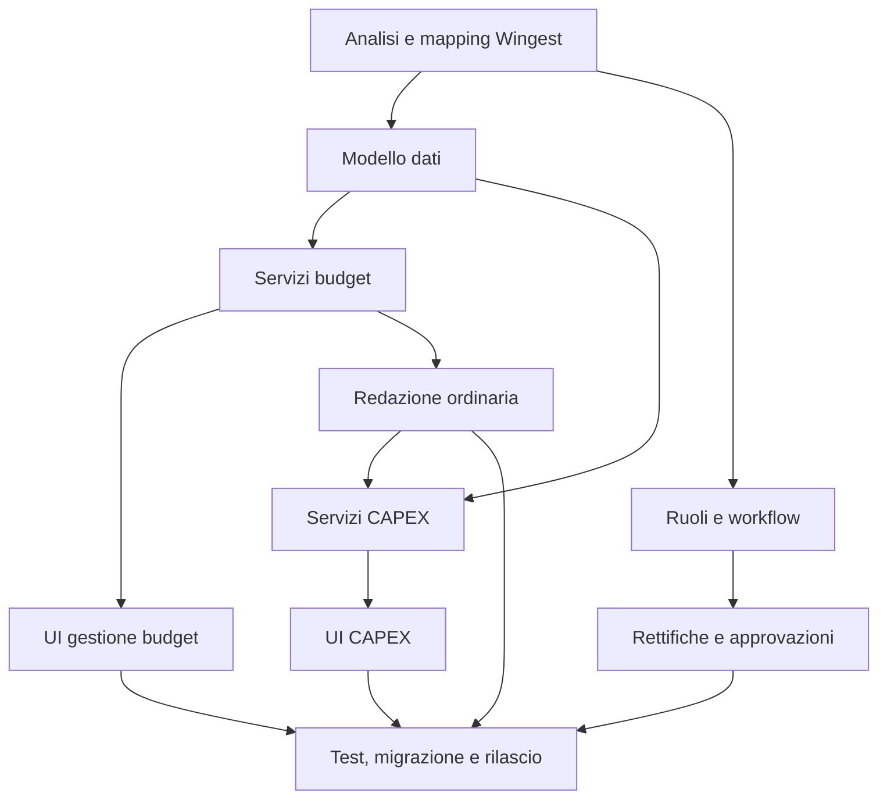

# Piano di implementazione

Aggiornamento: 25/09/2026.

## 1. Principio di realizzazione

Lo sviluppo deve procedere per sezioni verticali verificabili: modello e servizi, schermata, regole server-side, persistenza e test dello stesso flusso. Il mockup rimane il riferimento visuale; le specifiche e le decisioni validate prevalgono sui dettagli tecnici usati solo per la demo.

## 2. Sequenza proposta

### Fase 0 — Analisi Wingest e decisioni

- identificare modulo applicativo, servizi, archivi e convenzioni da riusare;
- mappare piano dei conti, CDC/livelli, commesse, utenti e permessi;
- chiudere le decisioni bloccanti elencate in `DECISIONI_DA_VALIDARE.md`;
- produrre il mapping tra concetti del mockup e oggetti Wingest.

**Uscita di fase:** mapping approvato, confini tecnici chiari e nessuna entità duplicata senza motivazione.

### Fase 1 — Fondazione dati e servizi

- creare il modello relazionale definitivo e le migrazioni;
- implementare letture di budget, livelli, voci, periodi e riepiloghi;
- implementare scritture puntuali transazionali e validazioni server-side;
- aggiungere concorrenza, audit, gestione errori e autorizzazioni di base.

**Uscita di fase:** API/servizi testati senza dipendere dallo stato JSON del mockup.

### Fase 2 — Budget ordinario

- gestione intestazioni e livelli;
- filtri realmente supportati;
- redazione mensile costi/ricavi;
- nuova voce, controllo sottoconto e redistribuzione;
- riepiloghi calcolati e rilettura dal backend dopo ogni salvataggio.

**Uscita di fase:** percorso completo di creazione e redazione di un budget ordinario con test automatici.

### Fase 3 — Rettifiche e approvazioni

- creazione, invio, approvazione e rifiuto;
- ruoli e transizioni autorizzate;
- audit con utente, data, motivazione e riferimento documentale;
- applicazione ai totali solo dopo approvazione.

**Uscita di fase:** una rettifica approvata aggiorna i riepiloghi una sola volta; una rettifica non approvata non li modifica.

### Fase 4 — Budget di investimento e CAPEX

- gestione commesse e fonti;
- voce CAPEX collegata alla voce budget;
- piano manuale, rate fornitore e finanziamento pluriennale;
- riconciliazione tra CAPEX aggiornato e capitale;
- ammortamento secondo la regola validata o integrazione con il modulo cespiti.

**Uscita di fase:** scenari CAPEX dei criteri di accettazione verificati end-to-end e senza doppio conteggio.

### Fase 5 — Migrazione, collaudo e rilascio

- definire se e quali dati demo o preesistenti migrare;
- riconciliare totali mensili, annuali, rettifiche e CAPEX;
- completare test di sicurezza, permessi, concorrenza, accessibilità e regressione;
- predisporre documentazione operativa e piano di rilascio/rollback.

**Uscita di fase:** esito di riconciliazione documentato e accettazione funzionale firmata.

## 3. Dipendenze principali

## 4. Regole comuni di completamento

Ogni ticket applicativo è completato solo quando:

- le regole decisive sono validate anche lato server;
- salvataggio e lettura usano la sorgente dati definitiva, non `localStorage`;
- gli errori sono espliciti e non producono un falso esito positivo;
- permessi e audit sono applicati dove previsti;
- i totali sono ricalcolati dal dettaglio e riletti dal backend;
- sono presenti test automatici per percorso positivo, validazioni e casi limite;
- la documentazione tecnica viene aggiornata se cambiano contratti o decisioni.

## 5. Fuori perimetro fino a nuova specifica

- consuntivi contabili, impegni e scostamenti;
- previsioni di tesoreria derivate dal CAPEX;
- import/export Excel o CSV;
- notifiche esterne;
- finanziamenti complessi, contributi, imposte e tassi variabili;
- automatismi contabili o cespiti non esplicitamente validati.
