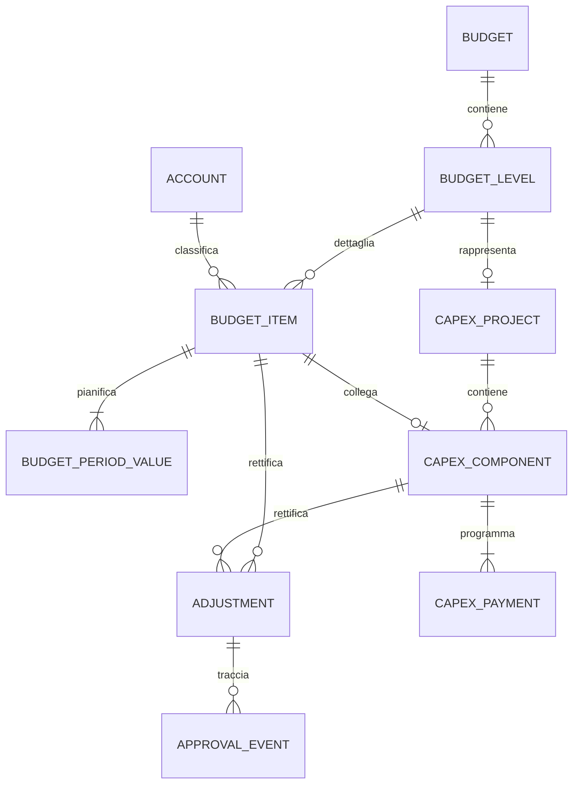

# Budget analitico Wingest — specifica funzionale e tecnica per l'integrazione ERP

Versione di riferimento: mockup locale modulare aggiornato il 29/09/2026. Le regole della sezione 2 sostituiscono la precedente impostazione basata su voci, sottoconti, costo/ricavo e tabella CAPEX. Le sezioni tecniche legacy successive restano solo come materiale storico da rivalutare prima dell'integrazione.

## 1. Obiettivo e confini

Realizzare nell'ERP una gestione di budget analitici **ordinari** e **di investimento** basata sui livelli della struttura analitica e sulla pianificazione mensile. Non sono previste nature costo/ricavo, voci libere o sottoconti nella nuova pagina. Il mockup HTML è il riferimento visuale e interattivo; il codice Python/JavaScript e i file SQLite sono un ambiente dimostrativo, non un'architettura prescritta per Wingest.

Il mockup conserva i dati legacy di rettifiche e CAPEX per non perderli durante la revisione, ma non li espone nella nuova pagina. Il consuntivo non è implementato.

### Artefatti consegnati

| File | Uso |
| --- | --- |
| `index.html`, `assets/css/styles.css`, `assets/js/` | Comportamento e aspetto del mockup modulare. Questo è il riferimento corrente, non il vecchio HTML monolitico. |
| `server.py`, `schema.sql` | Mini-server locale e persistenza dello stato demo. |
| `schema_normalizzato.sql` | Schema SQLite interrogabile di riferimento, non schema Wingest già validato. |
| `scripts/init_normalized_db.py` | Proiezione dei dati demo nello schema relazionale. |
| `query_esempio.sql` | Query per ispezionare budget, voci, rettifiche e CAPEX. |
| `ARCHITETTURA_DATABASE.md` | Proposta di evoluzione del modello. |
| `README.md` | Avvio del mockup. |

## 2. Comportamento delle schermate

### 2.1 Gestione budget

La prima pagina presenta una sola **riga verde per ogni versione del budget**. Non espone più le righe bianche dei livelli né il comando **Aggiungere voci**: l’utente gestisce il budget tramite versioning. La riga comprende almeno anno, nome, versione, periodicità, revisione, **struttura analitica associata**, tipo `Ordinario`/`Investimento` e stato. Gli unici stati ammessi sull’intestazione sono `Attivo`, evidenziato in verde, e `Disattivo`, evidenziato in grigio. Il comando **Copia** duplica l’intero budget, assegna il numero successivo rispetto alla versione più alta dello stesso nome e anno, rigenera gli identificativi tecnici dei livelli e crea la copia come `Disattivo`. Il comando **Elimina** richiede conferma e non consente di eliminare l’ultimo budget disponibile. La struttura analitica associata parte vuota e, in questa fase, resta un’informazione testuale liberamente compilabile: non è vincolata a un elenco CDC/commessa. Il comando **Apri analisi** apre l’intero perimetro della versione selezionata; i livelli restano dati interni dell’analisi e non sono modificabili dalla pagina Gestione Budget.

### 2.2 Redazione: regole comuni

**Nome BDG** seleziona la versione da redigere. Codici e descrizioni derivano dalla struttura configurata e non sono modificabili liberamente. Ogni tabella espone una CRUD coerente: lettura della griglia, aggiunta da elementi configurati, modifica dei valori ammessi ed eliminazione. La griglia non contiene una colonna Azioni: l'utente può selezionare una o più righe e abilitare i comandi **Modifica** ed **Elimina** nella testata; un secondo clic deseleziona la riga. In assenza di selezioni tutte le righe sono visibili. Selezionando più elementi di Livello 1, la tabella adiacente mostra l'unione dei figli collegati; selezionando più elementi di Livello 2, la pianificazione mostra tutte le relative righe mensili. Le relazioni impediscono di eliminare un padre finché contiene figli.

| Tabella | Contenuto e comportamento |
| --- | --- |
| 1. Livello 1 | Codice, descrizione, budget editabile e percentuale sul totale generale. Le percentuali di tutte le righe devono totalizzare il 100%; ogni modifica resta sulla riga scelta e il messaggio segnala l'eventuale eccedenza o quota mancante. È il punto iniziale di inserimento del budget. |
| 2. Livello 2 | Copia del comportamento di Livello 1: una sola percentuale editabile sul totale generale e budget calcolato sul totale. Ogni figlio resta collegato a un solo padre, il cui budget di Livello 1 è vincolante: la somma delle percentuali dei figli deve quindi quadrarsi con la quota percentuale del padre. La somma globale delle percentuali di Livello 2 deve essere 100%; le modifiche non cambiano le altre righe. In caso di eccedenza o quota mancante le celle restano editabili, le righe del gruppo padre diventano rosse e un messaggio indica percentuale e importo esatti da correggere. |
| 3. Pianificazione mensile | Per l'ordinario una riga per elemento di Livello 2; per l'investimento una riga per elemento di Livello 1. Dodici mesi editabili, totale e differenza rispetto al budget calcolato. La differenza rende la riga rossa e blocca il salvataggio. |

La regola unica della percentuale sul totale è intenzionale e riutilizzabile per eventuali livelli gerarchici aggiuntivi; il legame con il padre serve a verificare la quadratura, non introduce una seconda percentuale.

Modificando la percentuale o il budget di Livello 1, le percentuali dei figli non cambiano automaticamente: l'utente le riallinea sul totale e il controllo del gruppo segnala l'esatta differenza dal budget padre. Il budget mensile di ciascun figlio deriva dalla sua percentuale sul totale. Per un investimento/commessa si usa un solo livello: la tabella 1 contiene le righe di budget (ad esempio costo personale o costo impianto), la tabella 2 non è visibile e la tabella 3 pianifica mensilmente le righe della tabella 1.

**Regola funzionale per l'integrazione:** i pannelli dei livelli devono seguire la profondità della struttura analitica associata al budget: uno per una struttura a un livello, due per una struttura a due livelli. Il mockup attuale rappresenta le commesse di investimento con un livello e i budget ordinari con due; il collegamento ai livelli effettivi della struttura analitica e un eventuale terzo livello non sono ancora gestiti.

Per le commesse di investimento, **Ripartisci** nella tabella 3 può distribuire la voce su più anni. Il filtro **Anno**, esterno alla tabella, mostra e consente di modificare i dodici mesi dell'anno scelto; il totale della riga e del piede è annuale, mentre **Differenza piano** confronta il budget della voce con la somma di tutti gli anni. Nel popup l'**Importo complessivo** è modificabile: la conferma sostituisce il calendario precedente e aggiorna il budget della voce, il totale del budget e le percentuali. Anche per il budget ordinario l'importo è modificabile: aggiorna la voce, il suo Livello 1 padre e le percentuali sul nuovo totale, mentre le scadenze restano limitate all'anno del budget. La somma delle scadenze deve coincidere con l'importo complessivo indicato. Le rettifiche mensili della tabella 3 sono associate anche all'anno.

La modifica diretta di un mese nella tabella 3 aggiorna subito il budget della voce e i livelli superiori: per l'ordinario ricalcola il Livello 1 padre, il totale generale e le percentuali; per l'investimento ricalcola il budget della voce sulla somma di tutti gli anni, il totale generale e le percentuali. Gli altri mesi e le altre voci non vengono ridistribuiti automaticamente.

Nel Livello 1 delle commesse di investimento, l'inserimento degli importi determina il budget complessivo come somma delle voci e ricalcola tutte le percentuali sul nuovo totale. Dopo aver definito il totale, la modifica di una percentuale ricalcola l'importo della voce su quel totale di riferimento; le altre voci restano invariate finché l'utente non ne modifica le percentuali. Un totale percentuale diverso dal 100% segnala la quota da riallineare. La logica dei budget ordinari a due livelli resta distinta.

L'eliminazione di una riga mensile non elimina l'elemento analitico: rimuove la sua pianificazione e rende il budget non salvabile fino alla successiva aggiunta e quadratura. La copia di una versione conserva gerarchia, percentuali e mesi. Più versioni possono essere contemporaneamente `Attivo`.

## Appendice legacy non attiva

Il materiale seguente descrive la proposta precedente. Non rappresenta il comportamento corrente del mockup e dovrà essere riscritto o eliminato dopo la validazione definitiva della nuova gerarchia.

**Nuova voce personalizzata nella tabella 3.** L'utente seleziona livello, natura costo/ricavo, inserisce una descrizione libera (non limitata a un catalogo precompilato), indica sottoconto, importo e ripartizione iniziale. Il salvataggio crea la voce e i valori periodici; la nuova riga appare nella tabella 3 e i totali delle tabelle 2 e 1 si aggiornano senza inserimenti duplicati. Il sottoconto deve riferirsi a un conto valido nel piano dei conti Wingest; il campo libero riguarda la descrizione della voce, non la creazione automatica di un conto contabile. Il sottoconto non deve essere riutilizzato contemporaneamente con natura opposta senza una regola esplicita di riconciliazione. Va impedito il duplicato della stessa combinazione livello, sottoconto, voce e natura. Le modalità iniziali demo sono mensile, trimestrale o tutto in un mese.

**Ripartisci nella proposta precedente.** L'azione sulla riga della tabella 3 apriva il popup di redistribuzione con totale annuale fisso, durata, periodicità, data iniziale e righe data/importo. Era prevista una verifica separata per le voci collegate al CAPEX.

Nella proposta precedente, la durata e la periodicità non potevano portare scadenze fuori dall'anno del budget. Il pulsante **Rettifica** mostrava dodici coppie adiacenti, mese base e rettifica del medesimo mese. L'importo con segno inserito nella casella aggiornava subito il totale visibile e veniva salvato come rettifica applicata dopo una breve pausa nella digitazione o all'uscita dalla cella. Una modifica successiva registrava soltanto la differenza, così lo storico restava consultabile; azzerare la casella produceva uno storno. Il budget di un mese non poteva diventare negativo. Ogni rettifica era associata al budget e alla riga per evitare interferenze tra versioni. Il flusso separato di proposta e approvazione restava disponibile nel pannello storico per gli altri casi.

### 2.3 Redazione: solo investimento e tabella 4

La tabella 4 mostra **Commessa, Voce, Fonte, Vita utile, Stato, Gen–Dic, Pagamenti anno, Capitale residuo, CAPEX iniziale, Rettifiche, CAPEX aggiornato, Ammortamento dell'anno e Azioni**. Il selettore **Anno** determina l'anno delle dodici colonne, dei pagamenti, del residuo e dell'ammortamento mostrati. Il nome di colonna è **Voce**, non “Componente”; la colonna **Categoria** non è prevista nell'interfaccia. I dodici importi sono uscite pianificate (capitale più eventuali interessi), non un secondo costo da sommare alla tabella 3. È possibile aprire la modifica cliccando **Modifica voce** oppure un importo mensile.

La creazione di una voce CAPEX richiede commessa, descrizione, sottoconto, fonte di finanziamento, vita utile, stato, importo iniziale e data di investimento nell'anno del budget. La data di entrata in funzione alimenta la stima di ammortamento a quote costanti, con primo anno proporzionato ai mesi; non determina le scadenze di pagamento. Il salvataggio crea anche una voce di costo collegata nella tabella 3, se non esiste già. Una voce di ricavo dell'investimento, ad esempio un contributo, resta nella tabella 3 ma non diventa automaticamente una voce CAPEX.

Il piano offre tre modalità: **manuale** (dodici mesi dell'anno di budget, per compatibilità con le voci esistenti), **rate al fornitore** e **finanziamento**. Le ultime due generano scadenze datate su più anni indicando prima scadenza, numero di rate e periodicità mensile/trimestrale/annuale; il finanziamento richiede anche il tasso annuo. Nel demo il finanziamento copre l'intero CAPEX, non un importo parziale: alla data di investimento si assume il pagamento al fornitore mediante il finanziamento e la tabella 4 mostra le successive rate verso la banca. Non vengono simulati anticipo, spese bancarie, imposte, contributi, tassi variabili o modifiche del piano dopo erogazione. Questi casi richiedono una decisione funzionale prima dell'integrazione ERP.

**Scelta di progetto proposta per il mockup:** la tabella 3 è il calendario del *budget* della voce nell'anno di investimento; la tabella 4 è il calendario pluriennale dei *pagamenti/rimborsi*. I loro valori mensili e annuali possono differire. Si riconciliano il CAPEX aggiornato, il totale della voce budget collegata nell'anno di investimento e la **somma del capitale** di tutte le rate, non la somma delle uscite di un singolo anno. Gli interessi sono distinti dal capitale e non aumentano il CAPEX. Non bisogna spostare automaticamente i mesi del budget quando si cambia una data di pagamento. Una variazione dell'importo totale di una voce CAPEX deve invece mantenere uguali CAPEX e totale della voce budget; nel mockup il calendario di budget esistente viene ridimensionato proporzionalmente. La regola definitiva dopo approvazione è da validare con il cliente.

La **Fonte di finanziamento** della tabella 1 è un attributo manuale del livello/commessa. La **Fonte** della tabella 4 è un attributo della singola voce CAPEX. Oggi il primo campo può indicare “Fonti miste” e non aggiorna automaticamente le fonti delle voci sottostanti. Per l'ERP va deciso se mantenere questa distinzione o calcolare il riepilogo dalle voci.

## 3. Formule, invarianti e arrotondamenti

Per ogni voce `i`, mese `m` e natura `n`:

```text
budget_aggiornato(i,m) = budget_base(i,m) + somma(rettifiche_approvate(i,m))
totale_voce(i) = somma dei 12 budget_aggiornato(i,m)
totale_livello(n) = somma totale_voce(i) delle voci del livello con natura n
CAPEX_aggiornato(c) = CAPEX_iniziale(c) + somma(rettifiche_CAPEX_approvate(c))
somma del capitale di tutte le rate(c) = CAPEX_aggiornato(c)
uscite_pagamenti(c,anno) = capitale_scaduto(c,anno) + interessi_scaduti(c,anno)
totale_annuo_voce_budget_collegata(c) = CAPEX_aggiornato(c)
```

Le rettifiche in **Bozza**, **In approvazione** o **Respinte** non entrano nei totali ufficiali. I ricavi e i costi non si compensano nella tabella 1 o 2. Il totale CAPEX non va sommato nuovamente ai costi della tabella 3. Gli importi devono essere calcolati con decimali a due cifre (nel demo SQLite: centesimi interi); i controlli di uguaglianza vanno eseguiti in centesimi, mai confrontando direttamente numeri floating point.

**Attenzione al demo esistente:** la voce CAPEX “Impianti elettrici” espone 60.000 € iniziali + 20.000 € di rettifica = 80.000 € aggiornati; la voce budget collegata contiene già 80.000 € nei valori base del mockup. Il modello definitivo non deve applicare una *seconda* rettifica da 20.000 € sulla stessa voce di budget. Una sola variazione approvata deve alimentare entrambe le viste, senza doppio conteggio. Questo punto richiede una migrazione/riconciliazione esplicita dei dati demo, non una copia letterale del JSON.

## 4. Modello dati logico proposto



| Entità | Chiave e campi funzionali essenziali | Vincoli principali |
| --- | --- | --- |
| `budget` | ID, anno, nome, versione, revisione, tipo, periodicità, struttura, stato | Unicità definita per anno/nome/versione; storicizzare le revisioni effettive. |
| `budget_level` | ID, budget ID, codice, descrizione, fonte di finanziamento del livello (solo investimento), stato | Codice univoco nel budget; appartiene a un solo budget. |
| `account` | ID, codice, descrizione, natura, attivo | Collegare all'anagrafica/sottoconti Wingest esistente, previa verifica del mapping. |
| `budget_item` | ID, livello ID, account ID, voce, natura costo/ricavo | Una voce appartiene a un livello; possibile collegamento 1:0..1 a CAPEX. |
| `budget_period_value` | Voce ID, mese, importo base | Una riga per voce/mese/anno; dodici mesi in visualizzazione annuale. |
| `adjustment` e `approval_event` | Destinazione voce **oppure** CAPEX, mese se applicabile, importo, motivo, stato, attori e date | Non cancellare il budget base approvato; audit delle decisioni. |
| `capex_project` | Livello investimento, codice commessa, stato | Una commessa appartiene al budget di investimento. |
| `capex_component` | Progetto, voce budget collegata, descrizione, fonte, vita utile, data investimento, data entrata in funzione, modalità, prima rata, numero rate, periodicità, tasso, importo iniziale, stato | Il nome tecnico può restare `component`; in UI è “Voce”. `category` è legacy nel demo e non è un campo richiesto a video. |
| `capex_payment` | Voce CAPEX, data scadenza, capitale, interessi, uscita complessiva, stato | Anche più anni; somma del capitale pari al CAPEX aggiornato. |
| `capex_depreciation` | Voce CAPEX, anno, quota | Quota demo calcolata dalla data di entrata in funzione e dalla vita utile, indipendente dalle rate. |

Lo schema eseguibile di esempio è `schema_normalizzato.sql`. Non usarlo come migrazione diretta del database Wingest prima di aver mappato entità già esistenti, chiavi, permessi e regole contabili. `ARCHITETTURA_DATABASE.md` dettaglia l'evoluzione proposta.

## 5. Contratto applicativo suggerito per lo sviluppatore

Sono operazioni **da progettare nell'ERP**, non API Wingest già esistenti:

1. `GET budget + livelli + totali`: filtri anno, tipo, versione, stato; apertura di intestazione o livello.
2. `GET analisi`: voci, valori mensili, rettifiche approvate, riepiloghi calcolati, eventuale CAPEX.
3. `POST/PUT voce`: validazione natura/sottoconto, transazione che salva voce e dodici valori.
4. `PUT ripartizione`: sostituzione atomica dei dodici periodi; controllo del totale per la voce CAPEX collegata.
5. `POST/PUT voce CAPEX`: salvataggio atomico di voce CAPEX, collegamento alla voce budget, piano rate pluriennale e quote di ammortamento demo.
6. `POST rettifica` e comandi di approvazione: permessi, motivo, allegato/riferimento, storico e ricalcolo delle viste solo allo stato approvato.

Calcoli e vincoli vanno verificati **lato server**, non solo nel browser. In un'app multiutente occorrono identificativo stabile, controllo di concorrenza (versione/ETag o equivalente), transazioni, audit utente/data e risposta esplicita agli errori di validazione. Le tabelle 1 e 2 vanno alimentate da query o viste calcolate, non da importi duplicati editabili. La UI può aggiornarsi in anteprima, ma dopo il salvataggio deve mostrare i valori confermati dal backend.

## 6. Come ottenere, avviare e connettere il mockup

Il pacchetto distribuibile è `dist/Mockup_Budget_Analitico_Wingest_sviluppatore.zip`. Si rigenera dalla cartella del progetto con:

```powershell
py -3 scripts\create_developer_package.py
```

Se `py` non è presente, usare l'interprete Python 3 configurato sulla macchina. Il pacchetto contiene **codice, schema e documentazione**, ma non `data/*.db`, file WAL/SHM, cache Python, connessioni personali o il vecchio HTML monolitico. Per condividerlo con lo sviluppatore, consegnare il file ZIP tramite il canale aziendale approvato; il presente documento non presume un repository o un URL di download già pubblicato.

Lo sviluppatore estrae lo ZIP, apre la cartella `AppBudgetDemo` in VS Code, avvia `start.bat` (Windows) oppure `python server.py` dalla cartella, quindi apre `http://127.0.0.1:8793/`. Python 3 è l'unica dipendenza di runtime; non occorrono `npm` né pacchetti Python aggiuntivi. Al primo avvio la pagina popola i dati demo; attendere il completamento del caricamento prima di aprire il database.

Per ispezionare il modello con SQLTools/driver SQLite in VS Code: creare una connessione **SQLite** al file `data/budget_wingest.db` nella cartella estratta, aprire `query_esempio.sql` ed eseguire una query alla volta. Le query CAPEX distinguono capitale, interessi, uscite annuali e ammortamento. Il file `data/budget_mockup.db` contiene invece una sola riga JSON (`mockup_state`) ed è utile per il funzionamento del prototipo, non per analisi relazionali. `schema_normalizzato.sql` è il DDL completo del modello dimostrativo; `ARCHITETTURA_DATABASE.md` e il diagramma sopra sono il modello logico proposto. Se il database interrogabile manca, aprire la pagina una volta oppure eseguire `python scripts/init_normalized_db.py --replace` dopo che `budget_mockup.db` è stato creato.

Non collegare questo server alla rete aziendale o a un ambiente produttivo: ascolta solo su `127.0.0.1`, contiene dati demo e non implementa autenticazione/autorizzazione.

## 7. Criteri di accettazione minimi

1. Con budget **ordinario** sono visibili tabelle 1, 2 e 3; **non** la tabella 4. Con budget **investimento** sono visibili tabelle 1, 3 e 4; la tabella 2 non è visibile e il Livello 1 occupa tutta la larghezza della griglia. La tabella 4 presenta Gen–Dic, colonna “Voce” e nessuna colonna “Categoria”.
2. L'apertura dell'intestazione GRANA include GRA-001, GRA-002 e GRA-003; l'apertura di GRA-001 esclude gli altri livelli.
3. Aggiungendo nella tabella 3 un costo demo di 1.200 € a GRA-001, la tabella 3 mostra la riga e i totali della voce e del livello nelle tabelle 2 e 1 aumentano esattamente di 1.200 €. La stessa voce e i dodici valori sono interrogabili nel database.
4. La tabella 1 non ha “Durata”. Per investimento la fonte del livello è editabile e persiste al ricaricamento, senza modificare automaticamente le fonti delle singole voci CAPEX.
5. La tabella 4 permette modifica cliccando un mese o “Modifica voce”. Il selettore Anno mostra tutte le rate dell'anno scelto. In modalità manuale, spostare 5.000 € da marzo ad aprile lascia invariato il totale e non sposta automaticamente i mesi della tabella 3; un piano automatico va rigenerato quando cambiano i parametri.
6. Una macchina da 100.000 € con vita utile 10 anni, entrata in funzione il 01/01/2027, finanziamento completo in 120 rate mensili a partire da gennaio 2027 e tasso annuo 4% mostra CAPEX 100.000 €, ammortamento demo 2027 di 10.000 €, pagamenti/rimborsi anche dopo il 2027 e interessi separati. La somma del capitale delle 120 rate è 100.000 €, mentre le uscite complessive sono maggiori per gli interessi. Il piano resta disponibile dopo ricaricamento e in SQLite.
7. Un piano con capitale complessivo da 81.000 € contro CAPEX aggiornato da 80.000 € non può essere salvato. `CAPEX iniziale 60.000 + rettifica approvata 20.000 = CAPEX aggiornato 80.000`: il capitale di tutte le rate somma 80.000 €, senza doppio conteggio nella voce budget collegata.
8. “Ripartisci” sulla tabella 3 permette di modificare l'importo complessivo e distribuirlo nelle scadenze: per l'investimento anche su più anni, per l'ordinario nell'anno del budget. La conferma aggiorna budget della voce, totale e percentuali; nell'ordinario aggiorna anche il Livello 1 padre. Il filtro Anno mostra i mesi e il totale dell'anno scelto. La somma delle scadenze coincide con il nuovo importo; il piano pagamenti della tabella 4 non cambia automaticamente.
9. Le rettifiche non approvate restano visibili nello storico ma non incidono sui totali. Ogni salvataggio è atomico e non lascia budget/CAPEX disallineati.
